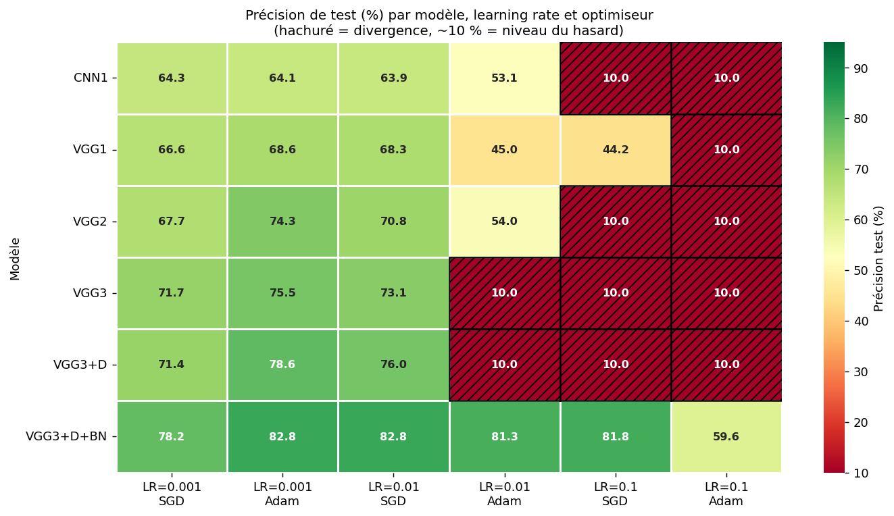
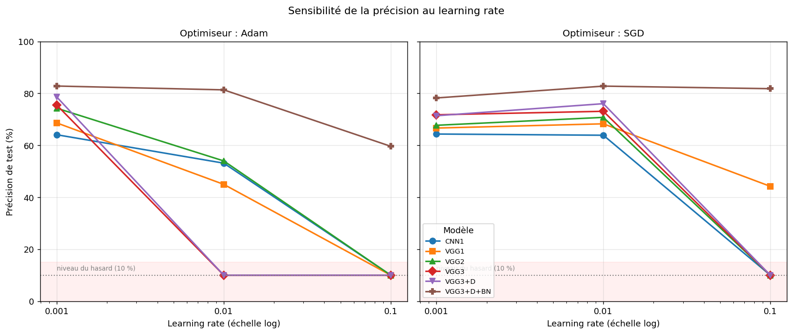
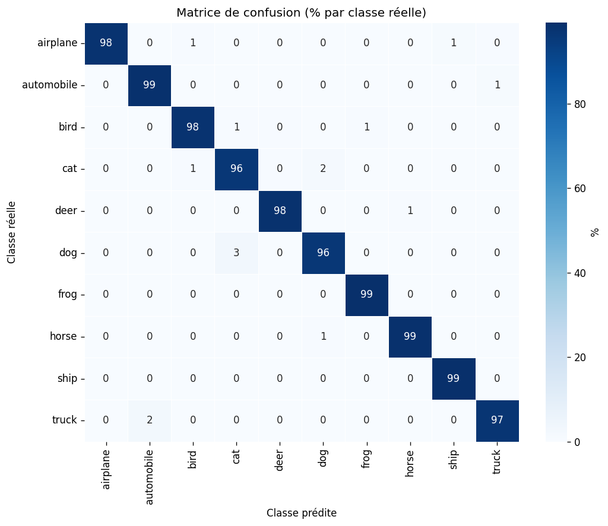

# ML Model Detection — CIFAR-10

Projet complet de classification d'images **CIFAR-10** avec des réseaux de
neurones convolutifs, suivant la méthodologie **CRISP-DM** : de l'analyse des
données jusqu'à une application web jouable.

**Application en ligne : https://machine-learning.bellahsene.org**

## Contenu du dépôt

| Élément | Description |
|---------|-------------|
| `TP_Project_ML.ipynb` | Notebook complet (Colab) : données, modèles, entraînement, résultats. |
| `projet_cifar10.py` | Script Python autonome (même logique que le notebook) + génération du rapport. |
| `report/Rapport_ML_CIFAR10.pdf` | Rapport en français (logique + résultats, style article). |
| `report_assets/` | Figures et résultats (`results.json`) produits par l'entraînement. |
| `playground-cifar-model/` | **Application web** (FastAPI + 3 mini-jeux) qui expose le modèle. |

## Résultats clés

- Grille comparative LeNet-5 / VGG1 / VGG2 / VGG3 × {SGD, Adam} × régularisation.
- Meilleure config « from scratch » retenue : VGG3 + Dropout + BatchNorm (**~85 %**).
- **Transfer learning EfficientNetB5 : ~97,9 %** (modèle servi par l'application).

## Résultats en images

**Heatmap de la grille (36 configurations)** — précision de test par modèle,
learning rate et optimiseur. La régularisation (Dropout + BatchNorm) domine,
et les hachures rouges montrent les configurations qui divergent :



**Sensibilité au learning rate** — Adam est excellent à 0.001 mais diverge
au-delà ; SGD est plus lent mais robuste ; la BatchNorm stabilise tout :



**Matrice de confusion du modèle final (EfficientNetB5, ~97,9 %)** — quasi
toute la masse sur la diagonale ; il ne reste que les confusions naturelles
(chat/chien, automobile/camion) :



## L'application

Trois mini-jeux qui tapent sur le modèle entraîné :

1. **Le Duel : Humain vs Machine** — 3 s par image, score comparatif sur 10 manches.
2. **Crash Test Pictionary** — dessine, l'IA devine en temps réel.
3. **Test Ultime CINIC-10** — images jamais vues à l'entraînement.

Détails techniques : voir [`playground-cifar-model/README.md`](playground-cifar-model/README.md).

## Tester l'application en local

Le modèle entraîné (`transfer_model.keras`, ~48 Mo) est inclus dans le dépôt :
l'application fonctionne immédiatement après le clone, sans rien entraîner.

```bash
git clone https://github.com/mehdibellahsene/projet-ml-cifar10.git
cd projet-ml-cifar10/playground-cifar-model
pip install -r requirements.txt
uvicorn app.main:app --port 8771
```

Puis ouvrir **http://127.0.0.1:8771** dans le navigateur.

Alternative avec Docker (aucune installation Python nécessaire) :

```bash
cd playground-cifar-model
docker network create bmr-internal   # réseau attendu par le compose (une seule fois)
docker compose up --build
# -> http://127.0.0.1:8771
```

## Auteur

Mehdi Redha BELLAHSENE
